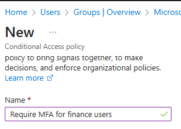
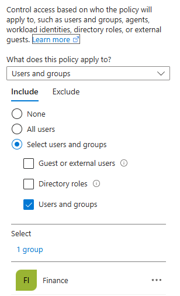
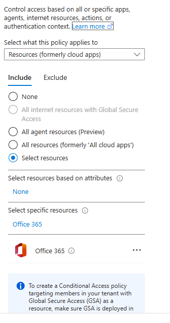
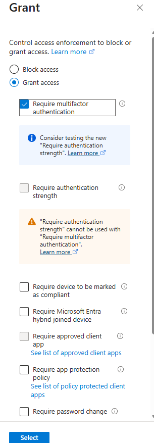

# Entra ID Conditional Access & Sign-In Troubleshooting

## Overview

This project demonstrates the implementation and investigation of an identity-driven
access control policy using Microsoft Entra ID (formerly Azure Active Directory).

The goal of the lab was to design a Conditional Access policy that enforces
multi-factor authentication (MFA) for a specific user group, then analyse how
that policy is evaluated during user sign-in using Entra sign-in logs.

This reflects common real-world tasks performed by IT support and junior infrastructure engineers.

---

## Environment

- Microsoft Entra ID (P2 lab tenant)
- Security groups
- Conditional Access
- Microsoft 365 cloud applications

---

## Scenario

Finance users require stronger authentication controls when accessing Microsoft 365.
A Conditional Access policy is created to require MFA for members of the Finance security group.

---

## Policy Configuration

### Policy Name

### Users & Groups Assignment
The policy applies to a Finance security group.

### Target Resources
The policy targets the Microsoft 365 cloud application.

### Grant Controls
Access is granted only after successful multi-factor authentication.

### Policy Mode
The policy was deployed in **Report-only** mode to safely observe its impact
without actively blocking users.

---

## Sign-In Test & Investigation

A Finance test user signed in to Microsoft 365.  
Because the policy was in **Report-only** mode, the sign-in was allowed, but
the policy evaluation was still recorded in the logs.

The sign-in logs show that MFA would have been required if the policy were enforced.

---

## Root Cause Analysis

The sign-in was evaluated against a Conditional Access policy that required MFA
for Finance users. The user did not provide a second authentication factor,
which would have caused the sign-in to be blocked if the policy were enforced.

---

## Resolution

In a production environment, the user would be required to complete MFA
registration and authentication before access is granted.

For the purposes of this lab, the policy remained in **Report-only** mode
to demonstrate policy evaluation and troubleshooting without disrupting access.

---

## Key Takeaways

- Conditional Access policies evaluate user identity, group membership, and target resources before granting access.
- Sign-in logs provide clear visibility into which policies were applied and why.
- Report-only mode is valuable for safely validating new access controls.
- Identity and access controls operate independently from application licensing.

---

## Skills Demonstrated

- Microsoft Entra ID administration
- Conditional Access policy design
- Identity-driven access control
- Sign-in log analysis and troubleshooting
- Secure authentication concepts
