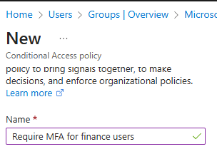
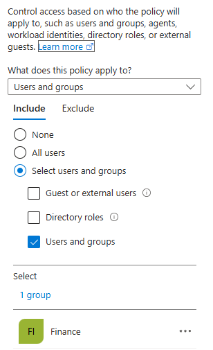
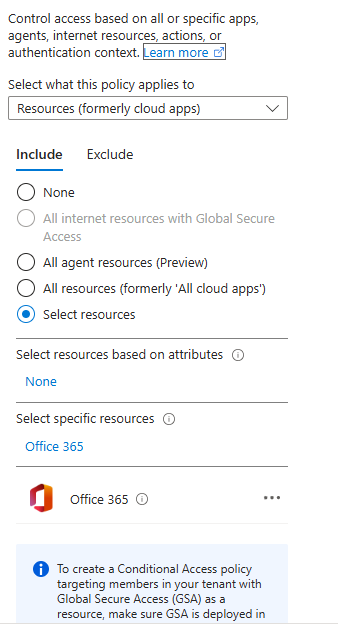
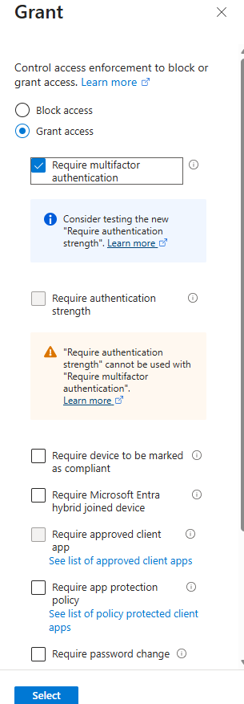

# Entra ID Conditional Access & Sign-In Logs

## Overview

This project demonstrates the implementation and investigation of an identity-driven
access control policy using Microsoft Entra ID (formerly Azure Active Directory).

The goal of the lab was to design a Conditional Access policy that enforces
multi-factor authentication (MFA) for a specific user group, then analyse how
that policy is evaluated during user sign-in using Entra sign-in logs.

This reflects common real-world tasks performed by IT support and junior infrastructure engineers.

---

## Scenario

Finance users require stronger authentication controls when accessing
Microsoft 365. 

Rather than applying the requirement to users individually, the Finance
users are placed in a security group. A Conditional Access policy then
targets the group and requires MFA when its members access Microsoft 365.

---

## Policy Configuration

### Policy Name

### Users & Groups Assignment
The policy applies to a Finance security group.

### Target Resources
The policy targets the Microsoft 365 cloud application.

### Grant Controls
Access is granted only after successful multi-factor authentication.

### Policy Mode
The policy was deployed in **Report-only** mode to safely observe its impact
without actively blocking users.

---

## Sign-In Test & Investigation

A Finance test user signed in to Microsoft 365.  
Because the policy was in **Report-only** mode, the sign-in was allowed, but
the policy evaluation was still recorded in the logs.

The sign-in logs show that MFA would have been required if the policy were enforced.

---

## Sign-In Analysis

The sign-in was evaluated against the Conditional Access policy because the
user was a member of the targeted Finance security group and was accessing
a targeted Microsoft 365 resource.

The sign-in logs showed that the MFA requirement would have applied if the
policy had been enabled.

---

## Considerations

Before enabling the policy in production, affected users should have an
appropriate MFA method registered.

Report-only results can be reviewed first to identify unexpected policy
matches or access issues before the policy is enforced.

---

## Key Takeaways

- Conditional Access policies evaluate user identity, group membership, and target resources before granting access.
- Sign-in logs provide clear visibility into which policies were applied and why.
- Report-only mode is valuable for safely validating new access controls.
- Identity and access controls operate independently from application licensing.

---

## Skills Demonstrated

- Microsoft Entra ID administration
- Conditional Access policy design
- Identity-driven access control
- Sign-in log analysis and troubleshooting
- Secure authentication concepts
